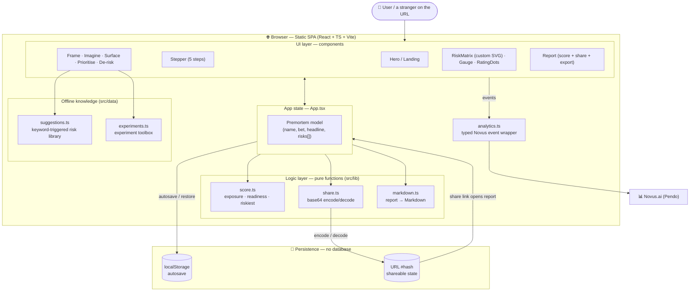

# Premortem

### Kill your idea before it kills your roadmap.

A 10-minute, no-sign-up **pre-mortem** for people who ship. Premortem walks you
through the technique that product teams swear by but rarely have a tool for:
assume your launch already failed, work backwards to find every reason why, map
those risks by likelihood × impact, and attach the cheapest experiment that
could prove you wrong — all *before* you write a line of code.

Built for **Mind the Product — World Product Day 2026: Everyone Ships Now.**
Premortem helps people ship the _right_ thing.

---

## Why it exists

> "Prospective hindsight — imagining that an event has already occurred —
> increases the ability to correctly identify reasons for future outcomes by 30%."
> — Gary Klein, the research behind the pre-mortem.

Teams are great at defending ideas and terrible at attacking them. A pre-mortem
flips the room. Premortem turns that exercise into something you can run solo,
**score**, and **share** in minutes.

## What it does

1. **Frame the bet** — name the thing, who it's for, and the single belief it rests on.
2. **Imagine the failure** — write the post-mortem headline from six months in the future.
3. **Surface the risks** — across the four classic lenses (Desirability, Usability,
   Feasibility, Viability), with an **offline suggestion engine** that recommends
   the failure modes most relevant to *your* product — no API key, instant.
4. **Map & prioritise** — an interactive likelihood × impact matrix surfaces your
   single **riskiest assumption**.
5. **Plan to de-risk** — a built-in experiment toolbox (fake door, Wizard of Oz,
   concierge, smoke test, willingness-to-pay…) recommends the lightest test for each risk.
6. **Report** — an exposure + readiness score, a shareable report, copy-to-Markdown,
   and print-to-PDF.

## Architecture

Premortem is a **zero-backend, client-side SPA**. All logic, scoring, persistence,
and sharing happen in the browser — the only external calls are static fonts and the
Novus (Pendo) analytics agent. The full diagrams (system + data lifecycle) live in
[`docs/ARCHITECTURE.md`](docs/ARCHITECTURE.md).



### Crafted to be genuinely shippable

- **Zero backend.** Everything runs client-side. A stranger can land on the URL and
  get value immediately.
- **Share with a link, no account.** The entire pre-mortem is encoded into the URL
  hash, so sharing works with no database.
- **Autosave** to `localStorage` so you never lose work.
- **Accessible, responsive, print-ready.**

## Tech

- React + TypeScript + Vite
- Tailwind CSS (custom design system)
- Custom SVG risk-matrix visualisation (no chart dependency)
- **Novus.ai** (Pendo) analytics — required for the hackathon

## Project docs

- [`docs/pitch-deck.html`](docs/pitch-deck.html) — 12-slide pitch deck (open in a browser; print to PDF)
- [`docs/ARCHITECTURE.md`](docs/ARCHITECTURE.md) — system + data-lifecycle diagrams and key decisions
- [`DEVPOST.md`](DEVPOST.md) — full Devpost submission write-up

## Run locally

```bash
npm install
npm run dev      # http://localhost:5173
```

Build for production:

```bash
npm run build
npm run preview
```

## Deploy (pick one)

Premortem is a static SPA — host it anywhere.

**Vercel**
```bash
npm i -g vercel
vercel            # framework preset: Vite — accept defaults
```

**Netlify**
```bash
npm i -g netlify-cli
npm run build
netlify deploy --prod --dir=dist
```

**GitHub Pages / Cloudflare Pages**: build command `npm run build`, output dir `dist`.

## Install Novus.ai (required for submission)

Novus is built on Pendo. The agent snippet is already wired into
[`index.html`](index.html); you only need to drop in your key:

1. Create your Novus account: https://novus.ai/
2. Copy your API key from the Novus install/settings page.
3. In `index.html`, replace `YOUR_NOVUS_API_KEY` with your key.
4. Redeploy.

Custom product events are sent through the typed wrapper in
[`src/analytics.ts`](src/analytics.ts) — e.g. `premortem_started`, `risk_added`,
`suggestion_used`, `experiment_picked`, `report_reached`, `share_link_created`.
This means your Novus dashboard shows not just page views but the **actual
product behaviours** that matter, ready to screenshot for the submission.

## Submission checklist (World Product Day)

- [x] New project, started in the hackathon window
- [x] Public, deployed URL a stranger can use right now
- [ ] Paste your Novus API key into `index.html` and redeploy
- [ ] Screenshot your Novus dashboard
- [ ] Record a 2–3 min demo video
- [ ] Write the short description (what / who / tools / what you learned)

---

_#EveryoneShipsNow_
