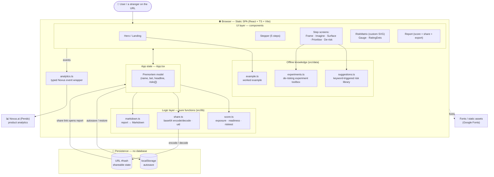
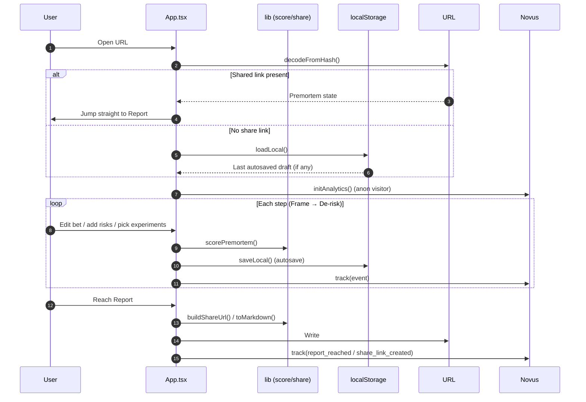

# Premortem — Architecture

Premortem is a **zero-backend, client-side single-page app**. All logic, scoring,
persistence, and sharing happen in the browser. The only external calls are static
asset/font delivery and the Novus (Pendo) analytics agent.

## System overview

## Request / data lifecycle

## Key architectural decisions

| Decision | Why |
| --- | --- |
| **No backend at all** | A stranger gets value instantly; nothing to host, secure, or scale. |
| **State encoded in the URL hash** | Sharing works with zero database — the link *is* the data. |
| **Pure-function scoring (`score.ts`)** | Deterministic, testable, and trivially fast in the browser. |
| **Offline suggestion engine** | Keyword-triggered library beats an API call for speed, privacy, and reliability — no key required. |
| **Custom SVG risk matrix** | No chart dependency, full control over the likelihood × impact visual. |
| **Typed analytics wrapper** | One place to define product events; safe no-op until a Novus key is present. |
| **localStorage autosave** | Never lose work, even with no account. |

## Tech stack

- **React 18 + TypeScript** — typed, component-driven UI
- **Vite 5** — fast dev server and optimized production build
- **Tailwind CSS** — custom design system (ember / sage / ink palette, Fraunces + Inter)
- **Custom SVG** — risk matrix and gauges, no chart library
- **Novus.ai (Pendo)** — product analytics
- **localStorage + URL hash** — persistence and sharing, no server
